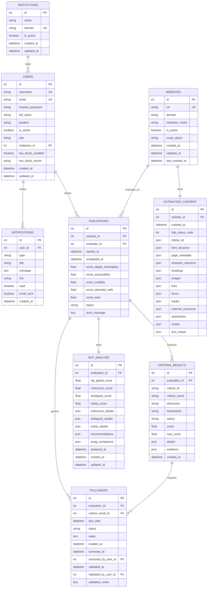

# Diagrama Entidad-Relación del Sistema

## Diagrama ER Completo

## Leyenda

- **PK**: Primary Key (Clave Primaria)
- **FK**: Foreign Key (Clave Foránea)
- **UK**: Unique Key (Clave Única)
- **||--o{**: Relación uno a muchos
- **||--||**: Relación uno a uno

## Cardinalidades

| Relación | Tipo | Descripción |
|----------|------|-------------|
| **INSTITUTIONS → USERS** | 1:N | Una institución puede tener muchos usuarios |
| **USERS → NOTIFICATIONS** | 1:N | Un usuario puede recibir muchas notificaciones |
| **USERS → EVALUATIONS** | 1:N | Un usuario puede realizar muchas evaluaciones |
| **USERS → FOLLOWUPS** | 1:N | Un usuario puede corregir/validar muchos seguimientos |
| **WEBSITES → EVALUATIONS** | 1:N | Un sitio web puede tener muchas evaluaciones |
| **WEBSITES → EXTRACTED_CONTENT** | 1:1 | Un sitio web tiene un único contenido extraído |
| **EVALUATIONS → CRITERIA_RESULTS** | 1:N | Una evaluación contiene muchos resultados de criterios |
| **EVALUATIONS → NLP_ANALYSIS** | 1:1 | Una evaluación tiene un único análisis NLP |
| **EVALUATIONS → FOLLOWUPS** | 1:N | Una evaluación puede generar muchos seguimientos |
| **CRITERIA_RESULTS → FOLLOWUPS** | 1:N | Un criterio no cumplido puede tener muchos seguimientos |

## Reglas de Integridad Referencial

### Cascadas de Eliminación (CASCADE)
- Al eliminar una **INSTITUTION**: se eliminan todos sus **USERS**
- Al eliminar un **WEBSITE**: se eliminan todas sus **EVALUATIONS** y su **EXTRACTED_CONTENT**
- Al eliminar una **EVALUATION**: se eliminan todos sus **CRITERIA_RESULTS**, **NLP_ANALYSIS** y **FOLLOWUPS**
- Al eliminar un **CRITERIA_RESULT**: se eliminan todos sus **FOLLOWUPS**
- Al eliminar un **USER**: se eliminan todas sus **NOTIFICATIONS**

### Anulación de Referencias (SET NULL)
- Al eliminar un **USER** evaluador: las **EVALUATIONS** quedan con `evaluator_id = NULL`
- Al eliminar una **INSTITUTION**: los **USERS** quedan con `institution_id = NULL`

## Índices Definidos

### INSTITUTIONS
- `id` (PK, automático)
- `domain` (UNIQUE)

### USERS
- `id` (PK, automático)
- `username` (UNIQUE)
- `email` (UNIQUE)
- `institution_id` (FK)

### WEBSITES
- `id` (PK, automático)
- `url` (UNIQUE)
- `domain`

### EVALUATIONS
- `id` (PK, automático)
- `website_id` (FK)
- `evaluator_id` (FK)

### CRITERIA_RESULTS
- `id` (PK, automático)
- `evaluation_id` (FK)
- `criteria_id`

### FOLLOWUPS
- `id` (PK, automático)
- `evaluation_id` (FK)
- `criteria_result_id` (FK)

### NLP_ANALYSIS
- `id` (PK, automático)
- `evaluation_id` (FK, UNIQUE)
- `nlp_global_score`
- `coherence_score`
- `ambiguity_score`
- `clarity_score`
- `analyzed_at`

### NOTIFICATIONS
- `id` (PK, automático)
- `user_id` (FK)
- `created_at`

### EXTRACTED_CONTENT
- `id` (PK, automático)
- `website_id` (FK, UNIQUE)

## Enumeraciones (ENUM)

### UserRole
- `superadmin` - Administrador del sistema
- `secretary` - Secretaría
- `evaluator` - Evaluador
- `entity_user` - Usuario de institución

### CrawlStatus
- `pending` - Pendiente de crawling
- `in_progress` - Crawling en progreso
- `completed` - Crawling completado
- `failed` - Crawling fallido

### EvaluationStatus
- `pending` - Evaluación pendiente
- `in_progress` - Evaluación en progreso
- `completed` - Evaluación completada
- `failed` - Evaluación fallida

### CriteriaStatus
- `pass` - Criterio cumplido
- `fail` - Criterio no cumplido
- `partial` - Criterio parcialmente cumplido
- `na` - No aplicable

### FollowupStatus
- `pending` - Pendiente de corrección
- `corrected` - Corregido (pendiente de validación)
- `validated` - Corrección validada
- `rejected` - Corrección rechazada
- `cancelled` - Seguimiento cancelado
