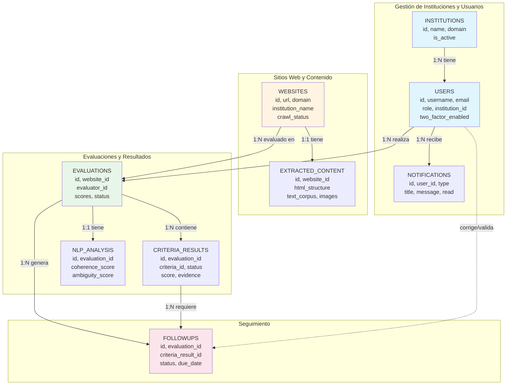

# Diagrama de Relaciones de la Base de Datos

## Diagrama de Entidades y Relaciones

## Descripción de Entidades

### 📋 INSTITUTIONS (Instituciones)
Almacena las instituciones gubernamentales bolivianas.
- **PK**: `id`
- **UK**: `domain` (único, ej: minedu.gob.bo)
- **Campos**: name, is_active, created_at, updated_at

### 👤 USERS (Usuarios)
Usuarios del sistema con diferentes roles.
- **PK**: `id`
- **UK**: `username`, `email`
- **FK**: `institution_id` → INSTITUTIONS
- **Roles**: superadmin, secretary, evaluator, entity_user
- **2FA**: two_factor_enabled, two_factor_secret

### 🌐 WEBSITES (Sitios Web)
Sitios web gubernamentales a evaluar.
- **PK**: `id`
- **UK**: `url`
- **Estados**: pending, in_progress, completed, failed

### 📊 EVALUATIONS (Evaluaciones)
Resultados de evaluaciones de sitios web.
- **PK**: `id`
- **FK**: `website_id`, `evaluator_id`
- **Puntajes**: score_accessibility, score_usability, score_semantic_web, score_digital_sovereignty, score_total

### ✅ CRITERIA_RESULTS (Resultados de Criterios)
Resultado individual de cada criterio (31 criterios).
- **PK**: `id`
- **FK**: `evaluation_id`
- **Estados**: pass, fail, partial, na
- **Criterios**: IDEN-01, ACCE-01, etc.

### 🔍 NLP_ANALYSIS (Análisis NLP)
Análisis de lenguaje natural con BETO.
- **PK**: `id`
- **FK**: `evaluation_id` (UNIQUE - relación 1:1)
- **Scores**: coherence, ambiguity, clarity, global

### 📌 FOLLOWUPS (Seguimientos)
Seguimiento de criterios no cumplidos.
- **PK**: `id`
- **FK**: `evaluation_id`, `criteria_result_id`
- **Estados**: pending → corrected → validated/rejected/cancelled

### 🔔 NOTIFICATIONS (Notificaciones)
Notificaciones in-app para usuarios.
- **PK**: `id`
- **FK**: `user_id`
- **Campos**: type, title, message, read, email_sent

### 📦 EXTRACTED_CONTENT (Contenido Extraído)
Contenido HTML extraído por el crawler.
- **PK**: `id`
- **FK**: `website_id` (UNIQUE - relación 1:1)
- **Datos**: html_structure, images, links, forms, text_corpus

## Cardinalidades

| Relación | Tipo | Descripción |
|----------|------|-------------|
| INSTITUTIONS → USERS | **1:N** | Una institución tiene muchos usuarios |
| USERS → NOTIFICATIONS | **1:N** | Un usuario recibe muchas notificaciones |
| USERS → EVALUATIONS | **1:N** | Un usuario realiza muchas evaluaciones |
| WEBSITES → EXTRACTED_CONTENT | **1:1** | Un sitio tiene un contenido extraído |
| WEBSITES → EVALUATIONS | **1:N** | Un sitio tiene muchas evaluaciones |
| EVALUATIONS → CRITERIA_RESULTS | **1:N** | Una evaluación tiene muchos resultados |
| EVALUATIONS → NLP_ANALYSIS | **1:1** | Una evaluación tiene un análisis NLP |
| EVALUATIONS → FOLLOWUPS | **1:N** | Una evaluación genera muchos seguimientos |
| CRITERIA_RESULTS → FOLLOWUPS | **1:N** | Un criterio genera muchos seguimientos |

## Reglas de Integridad

### CASCADE (Eliminación en Cascada)
- Eliminar INSTITUTION → elimina sus USERS
- Eliminar WEBSITE → elimina EVALUATIONS y EXTRACTED_CONTENT
- Eliminar EVALUATION → elimina CRITERIA_RESULTS, NLP_ANALYSIS y FOLLOWUPS
- Eliminar USER → elimina sus NOTIFICATIONS

### SET NULL (Anular Referencia)
- Eliminar USER evaluador → EVALUATIONS.evaluator_id = NULL
- Eliminar INSTITUTION → USERS.institution_id = NULL

## Índices Principales

- **INSTITUTIONS**: domain (UNIQUE)
- **USERS**: username, email (UNIQUE)
- **WEBSITES**: url (UNIQUE), domain
- **EVALUATIONS**: website_id, evaluator_id
- **CRITERIA_RESULTS**: evaluation_id, criteria_id
- **NLP_ANALYSIS**: evaluation_id (UNIQUE), scores
- **FOLLOWUPS**: evaluation_id, criteria_result_id
