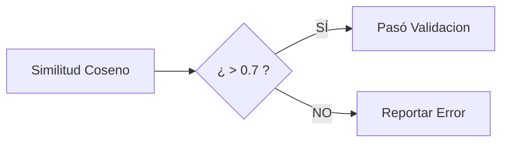

# Documentación Técnica: Módulo de Procesamiento de Lenguaje Natural (NLP)

Este documento describe la arquitectura y funcionamiento del módulo de NLP encargado de evaluar la calidad semántica y accesibilidad del contenido web.

## 1. Arquitectura del Sistema NLP

El sistema utiliza una arquitectura **Híbrida** que combina:
1.  **Reglas Heurísticas (Deterministas):** Para detección precisa de términos prohibidos, jerga vaga y cumplimiento normativo (WCAG).
2.  **Modelos de Lenguaje (Probabilísticos):** Uso de **BETO (Spanish BERT)** pre-entrenado para análisis de coherencia semántica mediante embeddings vectoriales.

### Diagrama de Flujo (Corregido)

```mermaid
graph TD
    %% Entradas
    subgraph Entrada
        JSON[JSON del Crawler] -->|Extrae| Textos[Textos: Enlaces, Labels, Headings]
        JSON -->|Extrae| Secciones[Secciones: Título + Contenido]
    end

    %% Proceso NLP
    subgraph "Motor NLP (Híbrido)"
        direction TB
        
        %% Flujo 1: Ambigüedad (Reglas)
        Textos --> PreProc1[Normalización de Texto]
        PreProc1 --> Matcher[Motor de Patrones / Regex]
        Matcher -->|Consulta| Diccionarios[Diccionarios: Genéricos, Ambigüos, Técnicos]
        
        %% Flujo 2: Coherencia (BETO)
        Secciones --> PreProc2[Truncado & Limpieza]
        PreProc2 --> Tokenizer[Tokenizador BETO]
        Tokenizer --> Model[Modelo BETO Pre-entrenado]
        Model -->|Genera| Embeddings[Vectores Semánticos]
        Embeddings --> Cosine[Cálculo Similitud Coseno]
    end

    %% Clasificación
    Matcher --> Clasificacion[Clasificación WCAG]
    Clasificacion --> Cat1[Genérico / "Click aquí"]
    Clasificacion --> Cat2[Ambiguo / "Nombre"]
    Clasificacion --> Cat3[Técnico / Siglas]

    Cosine --> ScoreCoherencia[Score Coherencia (0-100%)]

    %% Salida
    subgraph Salida
        Cat1 & Cat2 & Cat3 & ScoreCoherencia --> ReporteJson[JSON Resultados]
        ReporteJson -->|Contiene| Metrics[Métricas: Categoría, Confianza, Criterio WCAG]
    end

    style Model fill:#f9f,stroke:#333
    style Matcher fill:#ff9,stroke:#333
```

---

## 2. Componentes Principales

### A. Detector de Ambigüedad (AmbiguityDetector)
**Técnica:** Sistemas Basados en Reglas (Rule-Based System).
**Justificación:** La detección de términos como "Click aquí" o "Más info" requiere precisión absoluta (100%) para validar criterios WCAG. Un modelo de IA podría alucinar o fallar; una Regla Regular (Regex) nunca falla.

*   **Categorías Detectadas:**
    *   `TEXTO_GENERICO`: Enlaces que no dicen nada ("Ver más").
    *   `TEXTO_AMBIGUO`: Etiquetas de formulario sin contexto ("Nombre").
    *   `TEXTO_NO_DESCRIPTIVO`: Encabezados vagos ("Información").

### B. Analizador de Coherencia (CoherenceAnalyzer)
**Técnica:** Semantic Similarity con Transformers (BETO).
**Justificación:** Evaluar si el contenido de un párrafo "habla de lo mismo" que su título es subjetivo y semántico.
**Implementación:**
1.  Se usa `dccuchile/bert-base-spanish-wwm-cased`.
2.  Se vectoriza el **Título (H2)** y el **Contenido (P)**.
3.  Se calcula la similitud (Distancia Coseno).
4.  Si Similitud < 0.7 (70%), se marca como "Incoherente".

---

### C. Calibración del Umbral (Thresholding)
**Dónde**: `CoherenceAnalyzer` (Default: `0.7`).

Aunque no existe "Entrenamiento" (Fine-Tuning), sí existe una **Calibración de Hiperparámetros**.
El sistema utiliza un umbral de similitud de coseno para decidir binariamente si algo es coherente o no.

*   **¿Por qué 0.7?**
    *   `< 0.5`: Muy permisivo. Aceptaba textos basura como "coherentes".
    *   `> 0.8`: Muy estricto. Rechazaba textos válidos solo por usar sinónimos.
    *   **0.7 (70%)**: Punto de equilibrio determinado experimentalmente para el contexto de sitios gubernamentales.



---

## 3. Aclaración sobre "Fine-Tuning"

En esta versión del sistema, **NO se utiliza Fine-Tuning** (re-entrenamiento). Se utiliza el modelo en modalidad **Zero-Shot / Embeddings**.
## 4. Implementación en Código (Evidencia)

Para tu defensa, aquí están los bloques de código exactos que demuestran el diagrama "Model -> Embeddings -> Cosine":

### A. Generación de Embeddings (Vectores)
**Archivo**: `backend/app/nlp/models.py`
**Explicación**: El texto entra, pasa por `self._model` (BETO) y sale como un vector (embedding).

```python
# Lógica de Vectorización (BETO)
def encode(self, text: str) -> np.ndarray:
    # 1. Tokenizar (Convertir texto a números que BETO entiende)
    inputs = self._tokenizer(text, return_tensors='pt', ...)
    
    # 2. Inferencia (Pasar por las capas de la Red Neuronal)
    outputs = self._model(**inputs)
    
    # 3. Pooling (Convertir la salida matricial en un solo vector)
    # ... (cálculo de media de la última capa oculta) ...
    embedding = sum_embeddings / sum_mask
    
    return embedding # Retorna el vector numérico [768 dimensiones]
```

### B. Cálculo de Similitud Coseno
**Archivo**: `backend/app/nlp/models.py` (Línea ~158)
**Explicación**: Matemática pura. Producto punto dividido por la magnitud de los vectores.

```python
# Lógica de Comparación Semántica
def compute_similarity(self, text1, text2):
    # Paso 1: Convertir ambos textos a Vectores
    emb1 = self.encode(text1)  # Vector A
    emb2 = self.encode(text2)  # Vector B

    # Paso 2: Fórmula del Coseno
    # (A . B) / (||A|| * ||B||)
    dot_product = np.dot(emb1, emb2)
    norm1 = np.linalg.norm(emb1)
    norm2 = np.linalg.norm(emb2)
    
    # Paso 3: Resultado (0.0 = Distintos, 1.0 = Idénticos)
    return dot_product / (norm1 * norm2)
```

### C. Decisión Binaria (Thresholding)
**Archivo**: `backend/app/nlp/coherence.py` (Línea ~225)
**Explicación**: El "Juez" que dice SÍ o NO basado en la calibración.

```python
# Verificación de Coherencia
similarity = beto_manager.compute_similarity(heading, content)

# El umbral 0.7 decide
is_coherent = similarity >= self.coherence_threshold
```
